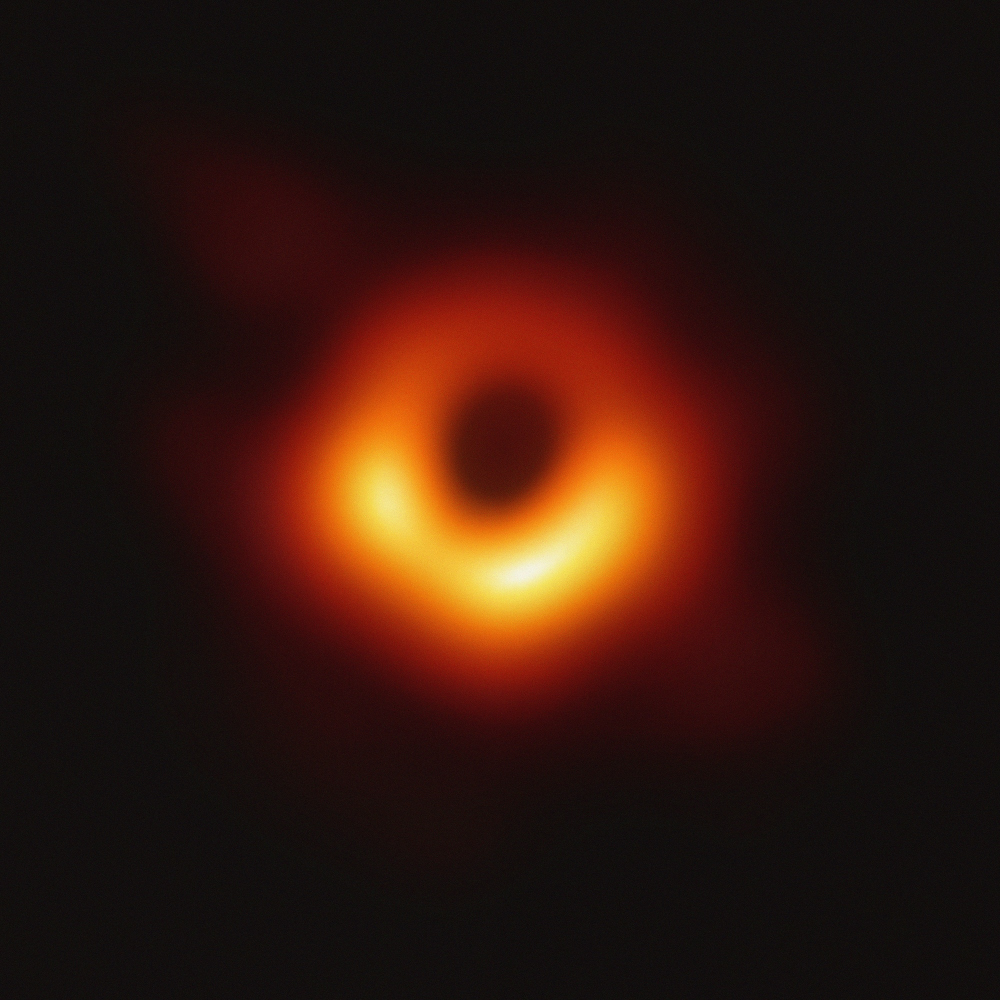
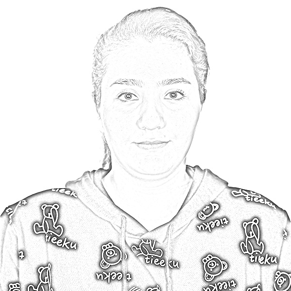
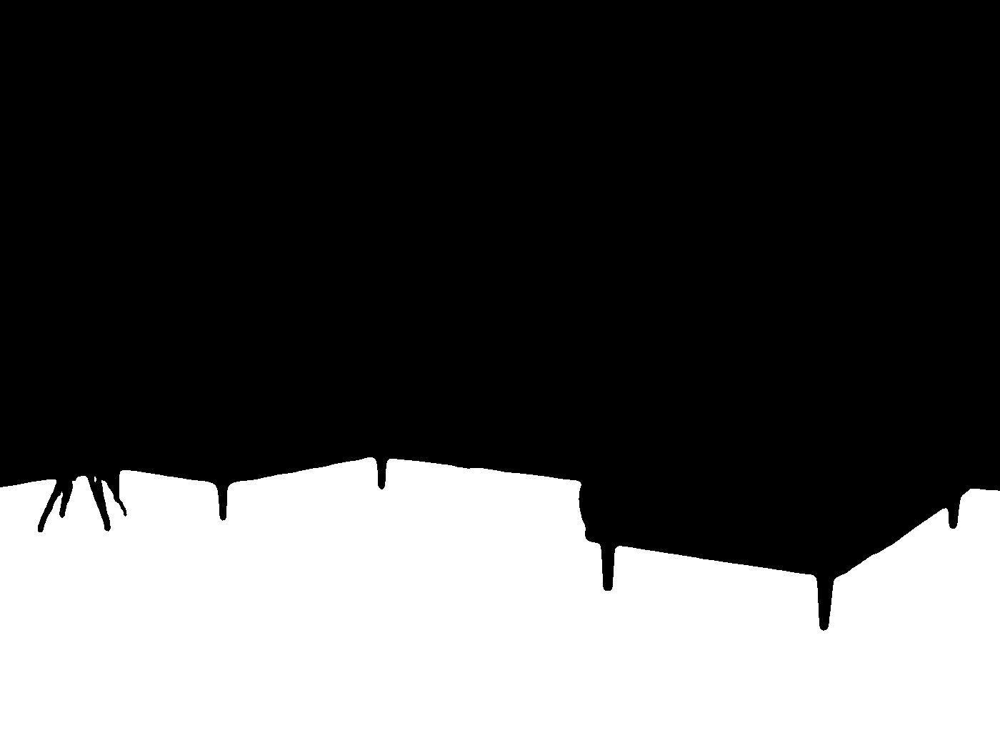
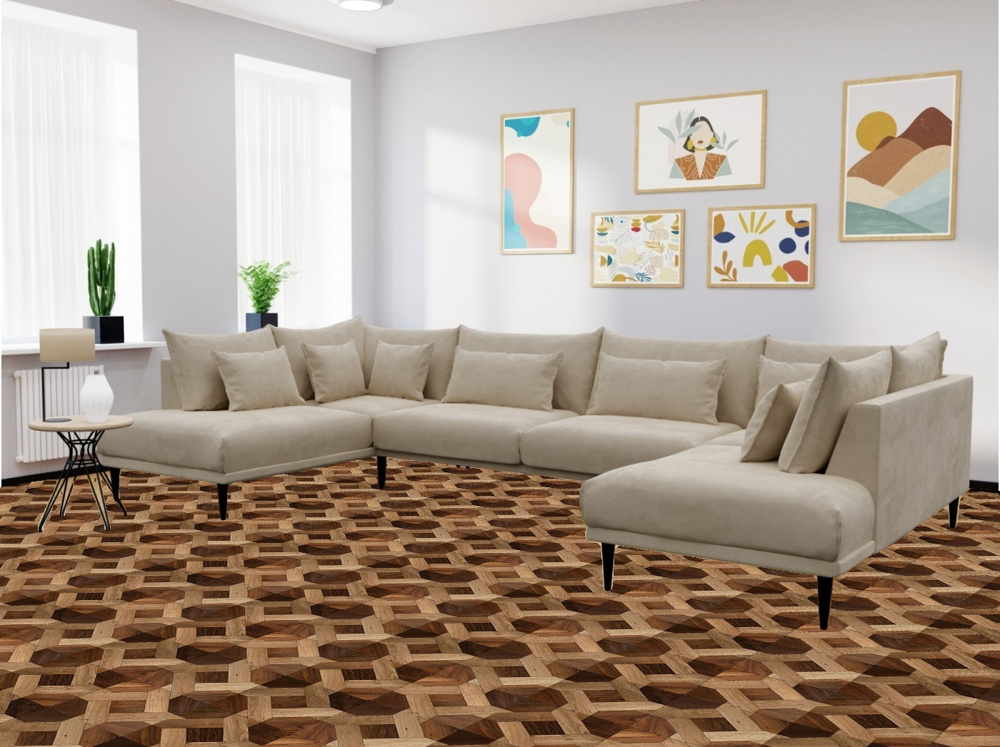

# assignment29 : Basic Math Operations

## How to Install
Run the following command :
```
pip install -r requirment.txt
```

## First part : ...

## Second part : Black Hole
By reducing the noise in different parts of this photo and stick them together the following picture appear:



## Third part : Photo to Sketch
the input photo is :


the sketch is :



## Fourth part : Find the Secret Text
The main text is :


And by using the below code breaker :


The secret massage will be :


## Fifth part : ...

## Sixth part : Virtual Decorator
By using the following mask :



This code decorate the floor of the following room by the following floor pictur :


The Decorated room is :

